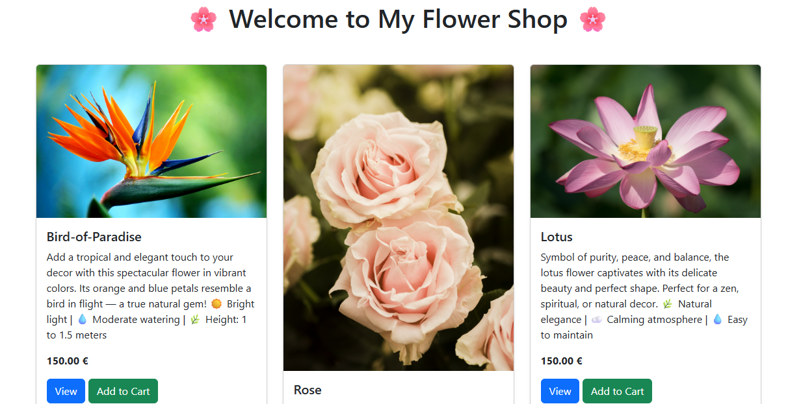
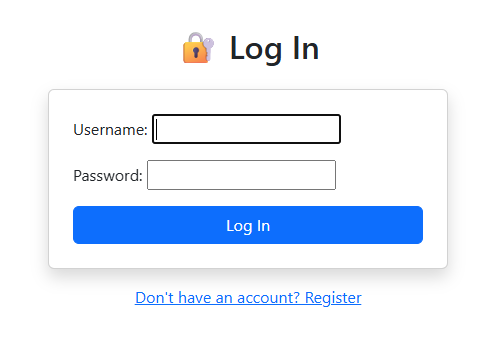
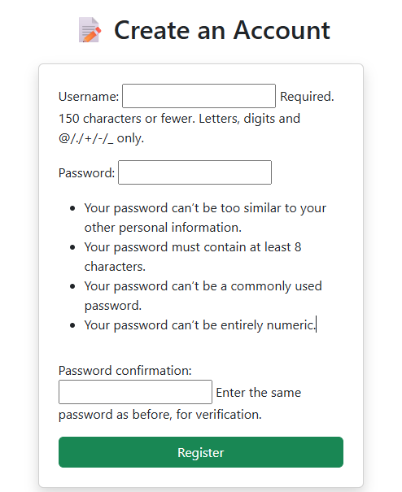
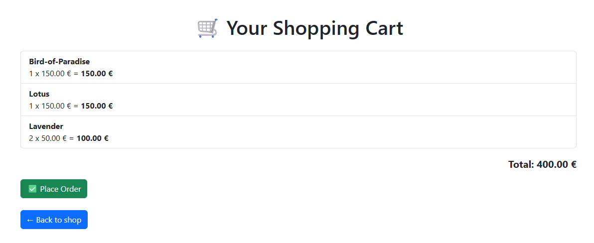

# 🌸 Flower Shop – CodeAlpha Internship (Task 1)

This is a basic e-commerce website for a flower shop, created as part of **Task 1** of the CodeAlpha Internship Program.

---

## 🛠️ Technologies Used

- **Backend**: Django (Python)
- **Frontend**: HTML, Bootstrap 5
- **Database**: SQLite
- **Authentication**: Django built-in user system

---

## ✨ Features

- 🔐 User registration & login
- 🌼 Product listing (flowers)
- 📄 Product detail page
- 🛒 Add to cart functionality
- ✅ Simulated order validation

---

## 📷 Screenshots

### 🏠 Homepage

### 🔐 Loginpage

### 📝 Registerpage

### 🛒 Shopping Cart

---

## 🚀 How to Run Locally

# Clone the repository
git clone https://github.com/codealpha-talent/CodeAlpha_Ecommerce.git
cd CodeAlpha_Ecommerce

# Create virtual environment (optional)
python -m venv env
env\Scripts\activate  # Windows

# Install dependencies
pip install -r requirements.txt  # Or install manually if no file

# Apply migrations
python manage.py migrate

# Run the development server
python manage.py runserver

Then visit: http://127.0.0.1:8000

---

## 🎥 Demo Video

Watch the full demo of the project here:  
👉 [Click to watch the video demo](https://drive.google.com/file/d/1gdAtaI3QvBpEXiHDCPTIGcEEpbqOJpDk/view?usp=sharing)

---

## 👩‍💻 Author

**Aya Boussader**  
Second-year student at ENSA Marrakech  
Created for the **CodeAlpha Summer Internship 2025**  
🔗 [My LinkedIn Profile](http://www.linkedin.com/in/aya-boussader-a6b043339)

---

## 📜 License

This project is open source and free to use.
